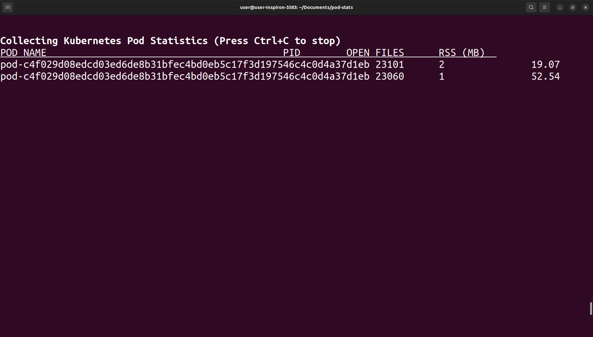

# pod-stats

The project uses uses eBPF to collect real-time statistics from Kubernetes pods on a single node, focusing on file opens and memory usage. It can be extended furthur to collect other stats, due to time constraints I worked till this basic implementation.

**src/pod_stats.h :**
- Defines struct pod_stats (open_files, rss_bytes, timestamp, pod_name) shared between kernel and userspace.

**src/bpf_prog.c :**
- Tracepoints:
  - sys_enter_openat: Increments open_files for each file open.
  - sched_switch: Updates timestamp (could be extended for more stats).

- Map: pod_stats_map (BPF hash map) stores stats by PID.

**src/bpf_prog.c :**
- Setup: Loads and attaches eBPF programs using libbpf.
- Stats Collection:
  - Polls pod_stats_map every 2 seconds.
  - Fetches RSS from /proc/<pid>/statm.
  - Maps PIDs to pod identifiers via /proc/<pid>/cgroup.
    

---------

## Implementation

- **Architecture :** Uses tracepoints for low-overhead monitoring; hash map ensures O(1) stat access.
- **Pod Identification :**  Parses cgroup paths, with temporary PID-to-name mapping (replaceable with Kubernetes API).
- **Optimization :**  Deduplication reduces output noise; could be further optimized with ring buffers for high-frequency updates.


## Limitations
   Outputs pod UIDs (e.g., pod-ad71dc62_baff_4ba7_9b97_0c182ef4f431) instead of names like nginx-pod which could be improved. Also other statistics could be added.
  
   
## Use cases

To track pod statistics over time, you can set up pod-stats as a cron job to log data periodically.

**1. Memory Usage Monitoring:** Observe RSS (MB) spikes to identify memory-intensive processes and also troubleshooting.
      
**2. Pod Health checking:** Verify that critical pods (e.g., nginx-pod) maintain stable resource usage, providing instant feedback on pod stability.

**3. Security monitoring [FUTURE IMPROVEMENT]:** Extend to track network I/O (e.g., via tcp_sendmsg) to detect unusual activity.

**4. Anomaly Detection and alerting [FUTURE IMPROVEMENT]:** Add thresholds for statistics and send alerts and Integrate with monitoring systems like Prometheus for time-series analysis and visualization


---------

## Steps to run

**1. Clone this repo and Navigate to directory**
      
**2. Compile the project**
   ```
   make
   ``` 

**3. Run executable**
   ```
   sudo ./pod-stats
   ``` 

	



